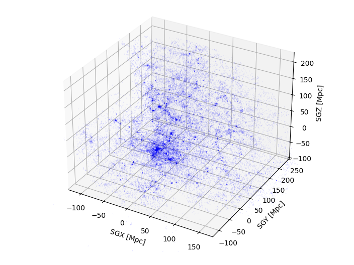

**Este código permite visualização gráfica rápida das distâncias extragalácticas via matplotlib.**



Disponibilizei `./data` com algumas bases de dados para usar de exemplo, porém considere obter os dados estrelares no The Extragalactic Distance Database (EDD) em casos objetivos: [https://edd.ifa.hawaii.edu/](https://edd.ifa.hawaii.edu/)


## Depedências

Instale as depedências necessárias:

```ps1
    pip install matplotlib numpy
```


